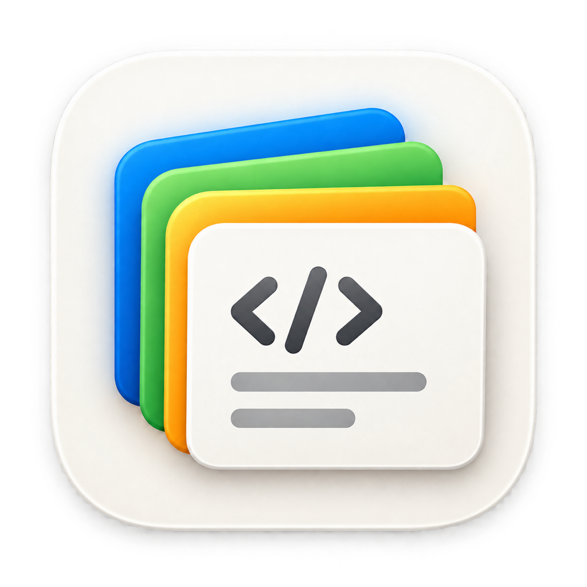
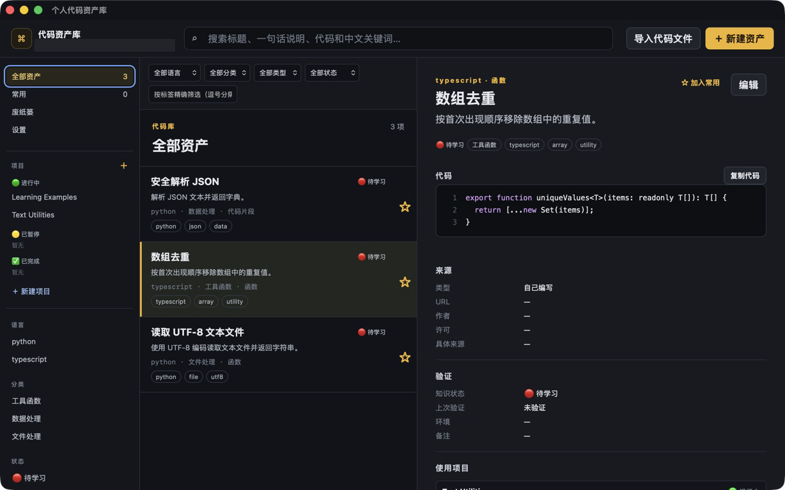
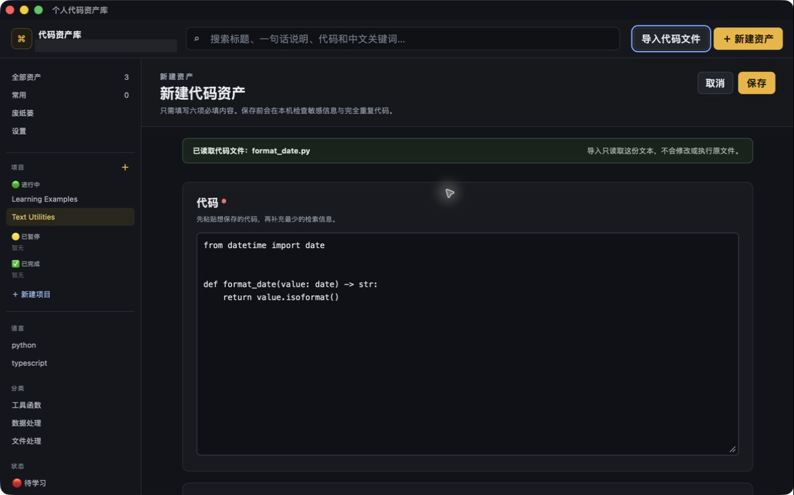
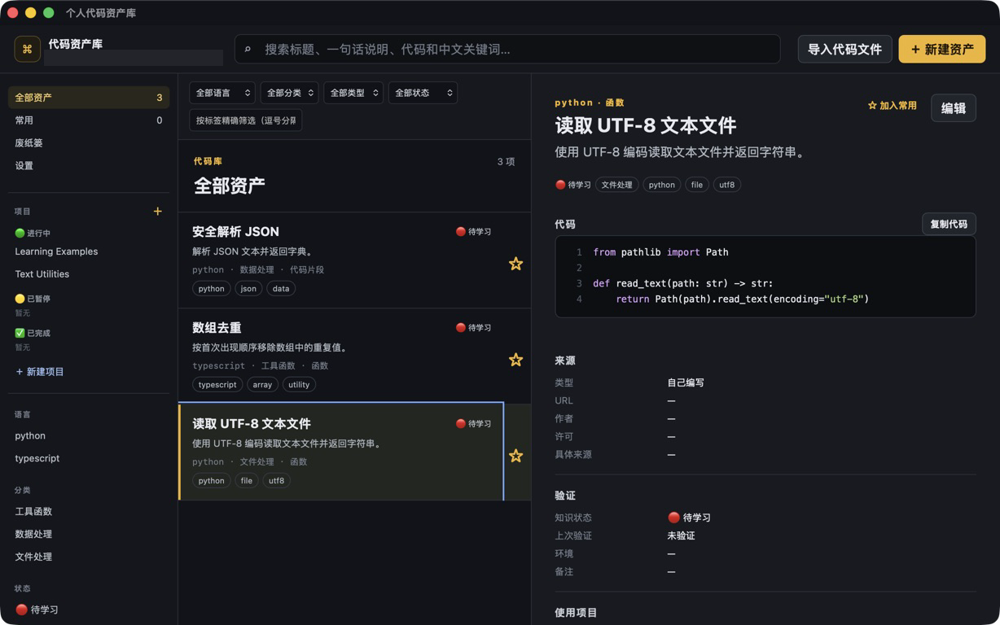
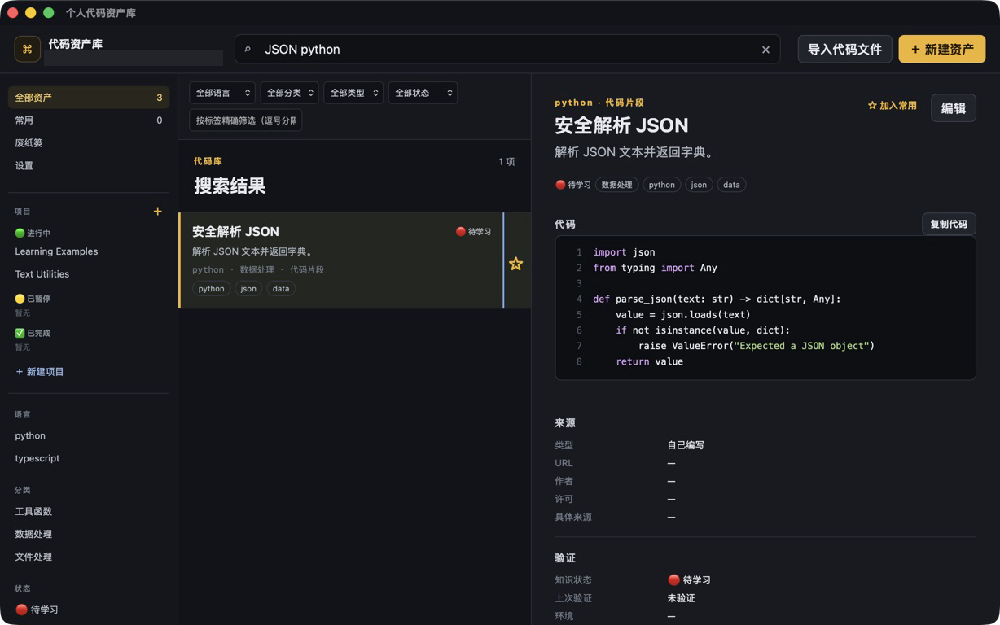
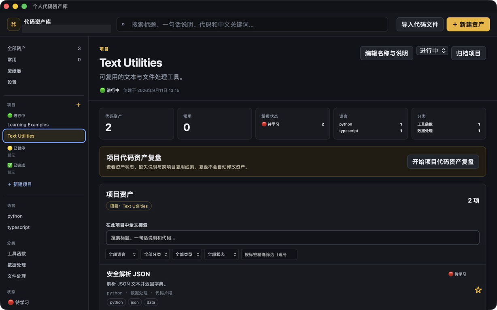
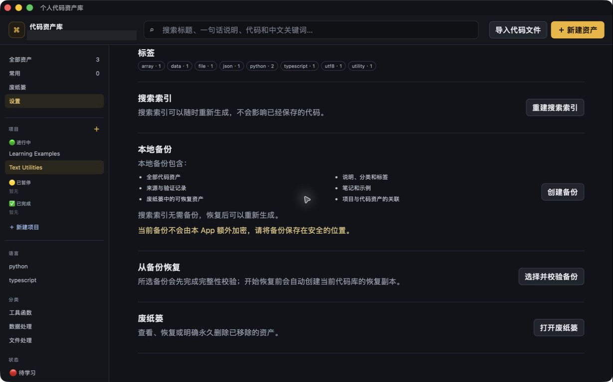
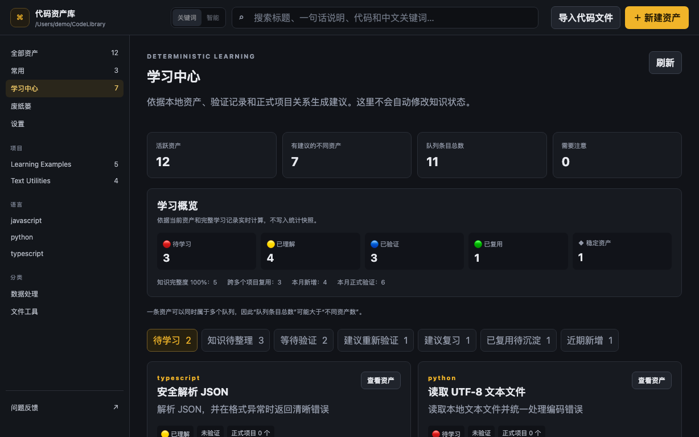
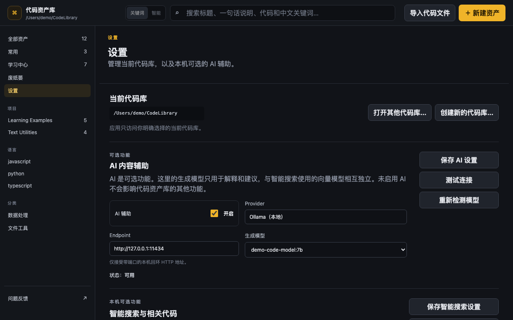

# 个人代码资产库

一个支持本地大模型接入的 Local-first macOS 个人代码资产管理与学习工具，用于收集、整理、搜索、理解和复用自己的代码。

## [⬇️ 下载 v0.2.2](https://github.com/yyttwo/personal-code-knowledge-base-releases/releases/tag/v0.2.2)

**当前版本：** v0.2.2 · **系统要求：** Apple Silicon Mac / macOS 11.0+

<p align="center">
  
</p>



## 核心能力

- 把脚本、命令和代码片段保存为结构化资产，管理标题、语言、类型、分类、说明、标签、来源和知识状态。
- 使用 Project 组织资产；同一份资产可以关联多个 Project。
- 使用普通全文搜索、中文多关键词搜索、结构化筛选，以及可选的本机智能搜索。
- 安全导入单个纯文本代码文件，自动预填标题、语言、正文和来源；不修改、不执行、不上传源文件。
- 通过学习中心整理知识完整度、验证历史、复习时间、状态和复用证据。
- 通过本机 Ollama 接入本地大模型，辅助理解代码、完善知识内容，并使用本地向量模型进行智能搜索。
- 使用可恢复的废纸篓，并在永久删除前再次明确确认。
- 从 App 底部直接进入 GitHub 结构化问题反馈表单。
- 创建版本化本地备份，恢复前校验备份并创建恢复副本。
- 正式数据使用普通文件保存；SQLite 仅作为可删除、可重建的搜索索引。

## 导入代码文件

点击“导入代码文件”，通过系统文件选择器一次选择一个纯文本代码文件。App 只读源文件，自动预填可编辑的资产表单；确认保存后，代码库会持有独立副本，不再依赖源文件。

导入边界内置多层防护：明显敏感的文件名、富文本、二进制、无效 UTF-8、超过 5 MiB 的文件和不安全符号链接会被拒绝；保存前还会提示潜在 Secret 和完全重复内容。App 不修改、删除、重命名、执行或上传导入文件。



## 学习中心

学习中心根据本地资产、验证记录和正式项目关系实时整理学习建议，不自动改变知识状态。页面包含知识状态概览、知识完整度、异常记录提示，以及“待学习、知识待整理、等待验证、建议重新验证、建议复习、已复用待沉淀、近期新增”7 类队列。

每条建议都说明原因和可执行的下一步。启用本机 AI 后，还可主动生成原理解释；结果先预览，再由用户决定是否保存。

## 废纸篓

删除资产会先移入废纸篓，代码、知识说明和学习记录会一起保留，可随时恢复。永久删除必须再次明确确认，且无法通过 App 撤销；重要数据建议先创建本地备份。

## 设置

设置页面用于管理当前代码库，并配置两项彼此独立、默认关闭的本机能力：

- **AI 内容辅助：** 通过本机 Ollama 生成解释和建议，结果不会自动写入资产。
- **智能搜索与相关代码：** 通过独立的本机 Embedding 模型建立语义索引，与普通关键词结果组合排序。

你可以在这里测试连接、检测和选择本机模型、更新语义索引，并查看当前分类与标签。两项能力仅接受本机回环地址，不连接云端模型，也不会自动下载模型。关闭它们不会影响其他核心功能。

## 问题反馈

侧边栏最下方提供“问题反馈”入口。反馈页会提示准备 App 版本、macOS 版本、Mac 芯片、重现步骤以及期望和实际结果；点击按钮后，会在默认浏览器中打开本仓库的结构化 GitHub Issues 表单。

提交前请移除 API Key、Token、密码、私有代码、真实代码库路径和其他敏感信息。App 只会打开固定的官方反馈地址，不会上传代码库内容。

## 本地大模型接入

App 支持通过 Ollama 使用完全运行在本机的大模型，不要求把代码发送到云端：

- **本地生成模型**负责代码原理解释、知识说明和学习建议。生成结果先预览，再由你决定是否采用。
- **本地 Embedding 模型**负责语义索引、智能搜索和相关代码推荐，适合“记得意思，但忘了名称”的查找场景。
- 两类模型角色分离，可独立开启、独立选择和独立测试；普通搜索不依赖任何模型。
- 连接范围限制为用户明确配置的本机回环地址，例如 `http://127.0.0.1:11434`。
- App 不会自动下载或管理模型；Ollama 及模型的安装、启动和删除仍由用户掌控。

### 推荐模型

生成模型用于解释代码、补充知识说明和生成学习建议。建议根据 Mac 的统一内存选择：

| Mac 统一内存 | 推荐生成模型 | Ollama 安装命令 | 适合情况 |
| --- | --- | --- | --- |
| 8 GB | `qwen2.5-coder:3b` | `ollama pull qwen2.5-coder:3b` | 体积较小，适合轻量使用 |
| 16 GB | `qwen2.5-coder:7b` | `ollama pull qwen2.5-coder:7b` | 推荐的均衡选择 |
| 24 GB 及以上 | `qwen2.5-coder:14b` | `ollama pull qwen2.5-coder:14b` | 更强的代码理解能力，但速度和内存开销更高 |

智能搜索需要单独安装 Embedding 模型：

| 推荐级别 | 推荐向量模型 | Ollama 安装命令 | 说明 |
| --- | --- | --- | --- |
| 首选 | `embeddinggemma` | `ollama pull embeddinggemma` | 小型本地向量模型，支持多语言、代码和技术文档；需要 Ollama 0.11.10 或更高版本 |
| 轻量备选 | `nomic-embed-text` | `ollama pull nomic-embed-text` | 体积较小，只用于生成向量，适合搜索与相似度匹配 |

安装完成后，在 App 的“设置”中点击“重新检测模型”，分别选择生成模型和向量模型，再测试连接。模型所需内存会受上下文长度和同时运行的其他程序影响；上表是保守的入门建议，不是硬性要求。更换向量模型后，需要在设置中重新构建语义索引。

模型详情：[Qwen2.5-Coder](https://ollama.com/library/qwen2.5-coder) · [EmbeddingGemma](https://ollama.com/library/embeddinggemma) · [Nomic Embed Text](https://ollama.com/library/nomic-embed-text)

## 界面预览

| 代码资产详情 | 全文搜索 |
| --- | --- |
|  |  |

| Project 管理 | 本地备份与恢复 |
| --- | --- |
|  |  |

| 学习中心 | 设置与本地大模型 |
| --- | --- |
|  |  |

所有截图均使用完全虚构的本地演示数据制作。

## 隐私与数据归属

- 核心功能不需要网络、账号或云服务。
- 不上传代码，不包含 Telemetry、Analytics、Cloud Sync 或代码执行。
- AI 与智能搜索仅在用户明确开启后连接本机回环 Ollama。
- App 只围绕用户明确选择的代码库、单个导入文件、备份和恢复位置工作。
- 删除或替换 App 不会自动删除代码库。

完整说明见 [PRIVACY.md](PRIVACY.md)。

## 下载与安装

从 [v0.2.2 Release](https://github.com/yyttwo/personal-code-knowledge-base-releases/releases/tag/v0.2.2) 下载：

- `personal-code-knowledge-base-v0.2.2-macos-arm64.zip`
- `SHA256SUMS.txt`

ZIP SHA-256：

```text
f68488612d177c38528764c2d72d33872b17d70b1f5f3ffbdcfda6f22e47ab3b
```

请在安装前核对完整性。完整安装步骤见 [INSTALL_MACOS.md](INSTALL_MACOS.md)。

当前版本未使用 Apple Developer ID 签名和公证。若系统阻止首次启动，请在 Finder 中按住 Control 点击 App 并选择“打开”，或前往“系统设置”→“隐私与安全性”使用系统提供的“仍要打开”选项。

## 已知限制

- 仅保证 Apple Silicon（arm64），Intel Mac 暂不保证支持。
- 不提供 Cloud Sync、文件夹批量导入、Git Import、GitHub Sync、VS Code 扩展、代码执行或自动更新。
- AI 与智能搜索需要用户自行运行兼容的本机 Ollama 模型。
- 当前采用个人本地安装方式，不提供 Mac App Store 版本，也没有 Developer ID 签名或 Apple 公证。

## 源代码状态

当前不公开核心源代码。本仓库仅用于产品说明、使用文档和正式版本下载。详见 [SOURCE_CODE_NOTICE.md](SOURCE_CODE_NOTICE.md)。

## 安全反馈

公开反馈时，请勿在 GitHub Issue 中粘贴 API Key、Token、密码、私有代码或敏感代码库内容。发现安全或隐私问题时，请先阅读 [SECURITY.md](SECURITY.md)。
