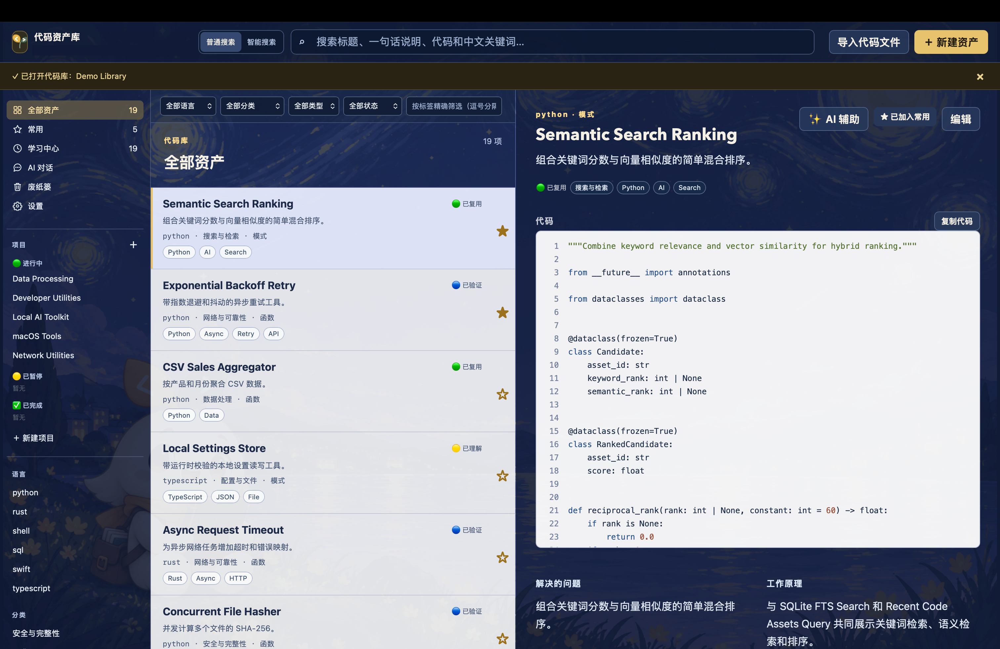
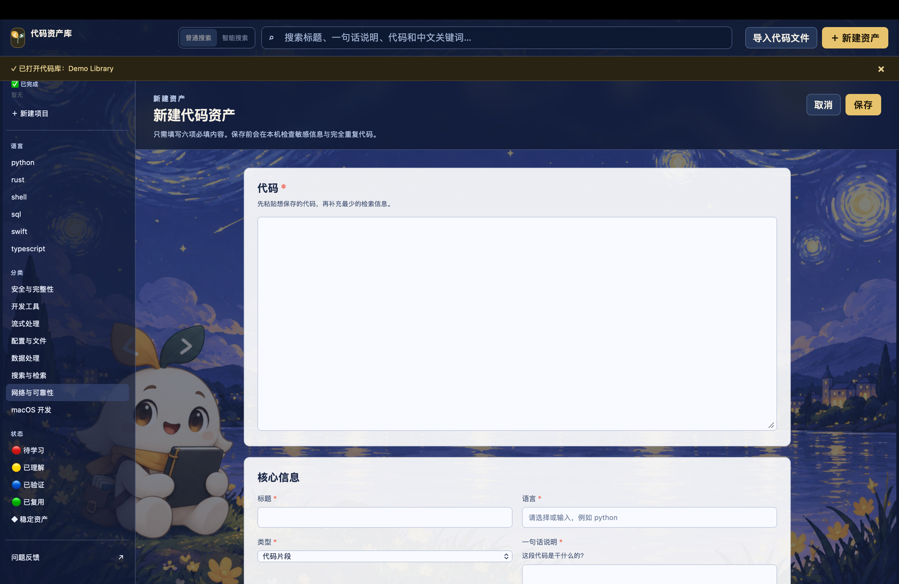
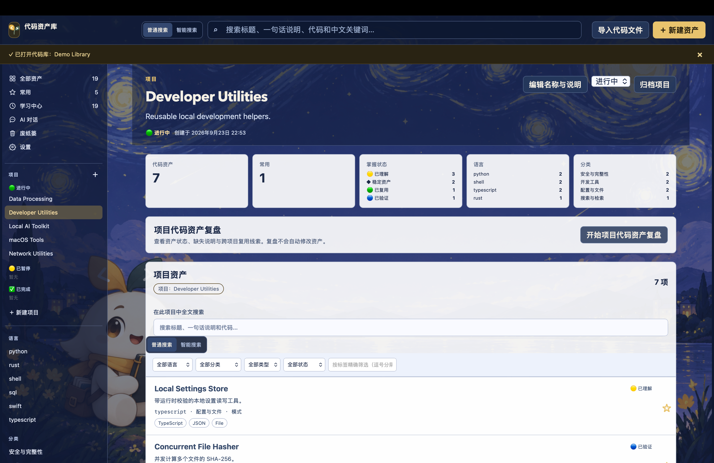
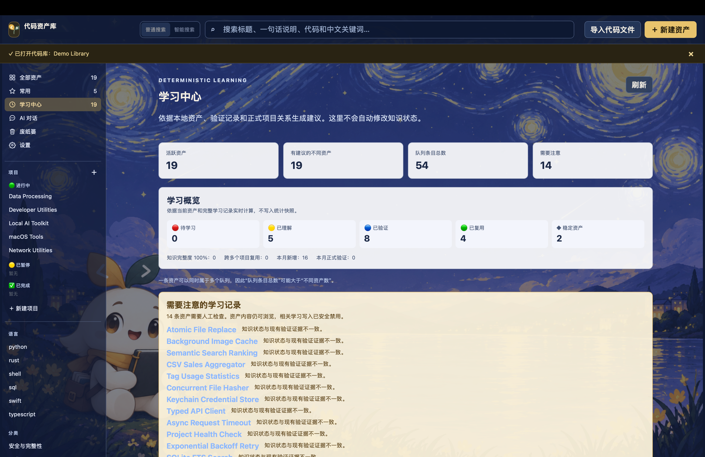
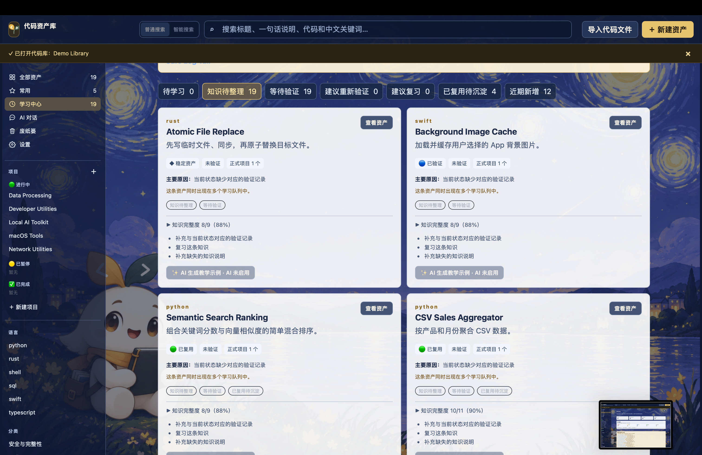
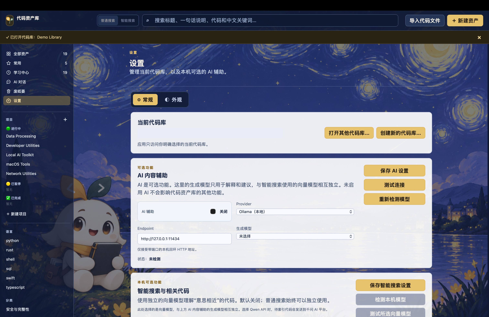
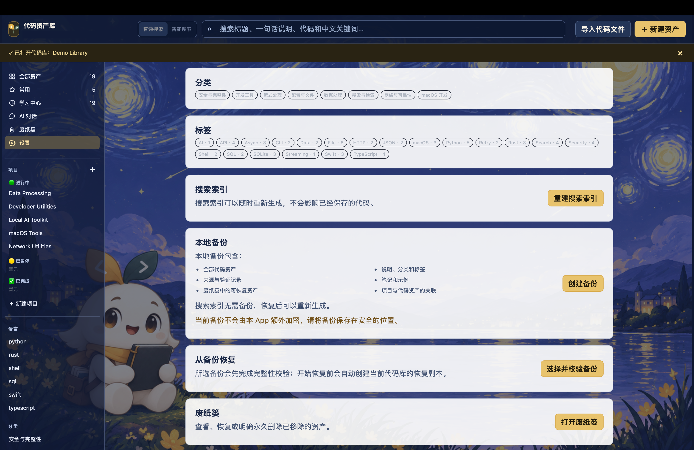
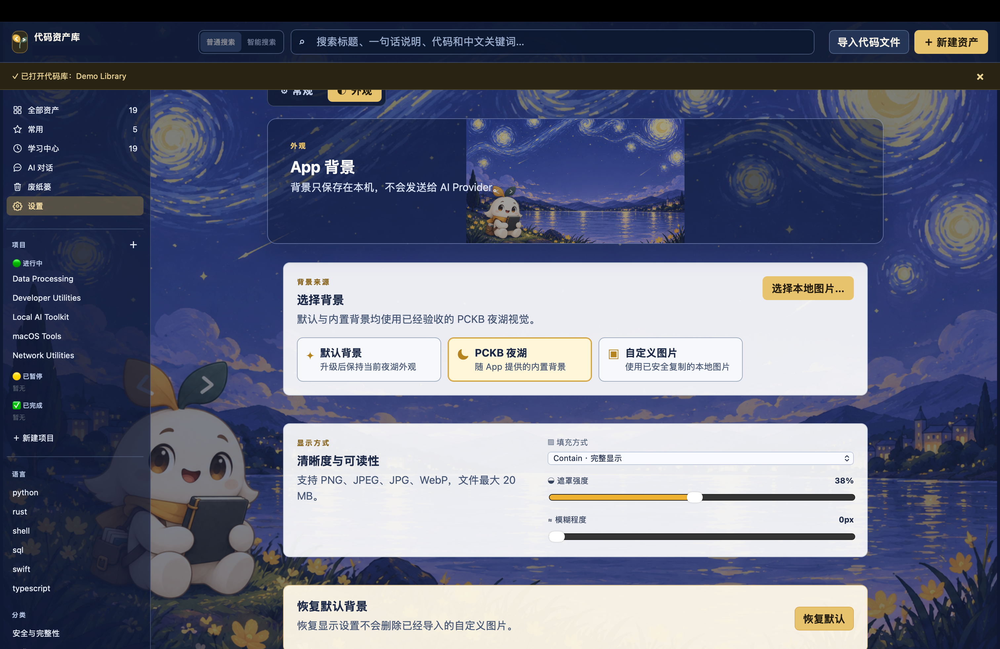

# PCKB

个人代码知识库

把你写过、学过和收藏过的代码，变成一个可以搜索、理解和直接提问的个人代码知识库。

[English](README.md) | [简体中文](README.zh-CN.md)

**公开预览版 · macOS Apple Silicon · 持续开发中 · 源码目前未开放**

PCKB 仍在持续开发中。本仓库是公开二进制发布仓库，不包含产品核心源代码。

以下均为使用虚构演示代码库拍摄的真实 PCKB 截图。本机私人路径已用不透明色块遮挡，其他产品内容未修改。

## 下载 macOS 版

正式发布后，可从 [v0.4.0 Release](https://github.com/yyttwo/personal-code-knowledge-base-releases/releases/tag/v0.4.0) 下载 `PCKB-0.4.0-Public-Preview-macOS-arm64.zip`。

系统要求：Apple Silicon Mac（arm64），macOS 11.0 或更高版本。

本 Public Preview 使用 ad hoc 签名，**没有** Apple Developer ID 签名，也**没有**经过 Apple 公证。安装前请核对公开的 SHA-256。首次启动被拦截时，请按 [INSTALL_MACOS.md](INSTALL_MACOS.md) 使用 macOS 正常图形界面操作。

## 功能

- 个人代码资产库、Project、标签、常用、学习状态和验证记录
- 全文搜索、结构化筛选和可选的语义搜索
- 安全的单文件导入、可恢复废纸篓和本地备份/恢复
- AI 代码辅助与 AI 对话
- 仅保存在本机的自定义 App 背景

## 产品截图

### 收集与整理

| 新建代码资产 | 管理项目 |
| --- | --- |
|  |  |

### 学习与复习

| 学习中心概览 | 资产学习卡片 |
| --- | --- |
|  |  |

### 设置与保护

| AI 与智能搜索设置 | 备份与恢复 |
| --- | --- |
|  |  |

### 自定义外观

当前演示代码库没有选择生成模型，因此本版暂不展示 AI 对话截图；AI 对话功能仍可使用。

## AI 选项

- **Ollama：** 可选的本机生成与向量能力
- **DeepSeek API：** 可选的自备 Key 生成与 AI 对话
- **Qwen API：** 可选的自备 Key 生成、AI 对话与向量能力
- Generation 和 Embedding Provider 相互独立
- API 凭据通过 macOS 钥匙串保存
- 不会自动回退到其他云端 Provider

云端 AI 操作会把完成用户主动请求所需的内容发送给所选 Provider。完整边界见 [PRIVACY.md](PRIVACY.md)。

App 提供内置 PCKB 夜湖背景，也支持选择本地图片，调整遮罩、模糊与 Cover/Contain 显示方式。背景图片保存在本机。

## 快速开始

1. 下载最新 Public Preview ZIP。
2. 解压 ZIP。
3. 将 `PCKB.app` 移到“应用程序”。
4. 打开 PCKB，创建或打开本地代码库。

## 隐私

代码库主要以普通文件保存在用户选择的本机文件夹中。Ollama 支持本机 AI 工作流；DeepSeek 与 Qwen 是可选的外部 BYOK Provider。PCKB 不会自动切换到其他云端 Provider。

## 文档

- [macOS 安装说明](INSTALL_MACOS.md)
- [用户指南](USER_GUIDE.md)
- [隐私说明](PRIVACY.md)
- [安全反馈](SECURITY.md)
- [源代码状态](SOURCE_CODE_NOTICE.md)

## 法律说明

PCKB 以专有免费软件形式分发。下载、安装或使用 PCKB 均受 [PCKB EULA](legal/PCKB-EULA.txt) 约束。第三方开源组件继续适用各自许可证；请同时阅读[第三方声明](legal/THIRD-PARTY-NOTICES.txt)、[组件源码出处](legal/OPEN-SOURCE-COMPONENT-SOURCES.md)和[开源许可证文本](legal/OPEN-SOURCE-LICENSES/)。

## 已知限制

- 仅支持 Apple Silicon（arm64）；当前不支持 Intel Mac。
- 没有 Apple Developer ID 签名，也没有 Apple 公证。
- 不提供云同步、自动更新、文件夹批量导入、Git/GitHub 同步、VS Code 扩展或代码执行。
- Ollama 模型需要用户自行安装和管理；DeepSeek 与 Qwen 需要用户自己的 API Key、网络连接及服务额度。
- 当前是持续开发中的公开预览版，不是稳定版或功能完整版本。

## 许可

PCKB 应用不是开源软件。安装与使用受 [EULA](legal/PCKB-EULA.txt) 约束，下载包内也会包含该文件。第三方声明单独提供，并且不会削弱第三方开源许可证授予的权利。
